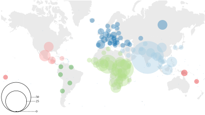

# LIMIT: Language Identification, Misidentification, and Translation


 

# Cite this project
Please consider citing our paper if you use the data, benchmarking results, or the (mis)identification hierarchical modeling approach. A bibtex blurb will be available once the paper is live on arxiv
```
@misc{agarwal2023limit,
      title={LIMIT: Language Identification, Misidentification, and Translation using Hierarchical Models in 350+ Languages}, 
      author={Milind Agarwal and Md Mahfuz Ibn Alam and Antonios Anastasopoulos},
      year={2023},
      eprint={2305.14263},
      archivePrefix={arXiv},
      primaryClass={cs.CL}
}
```

